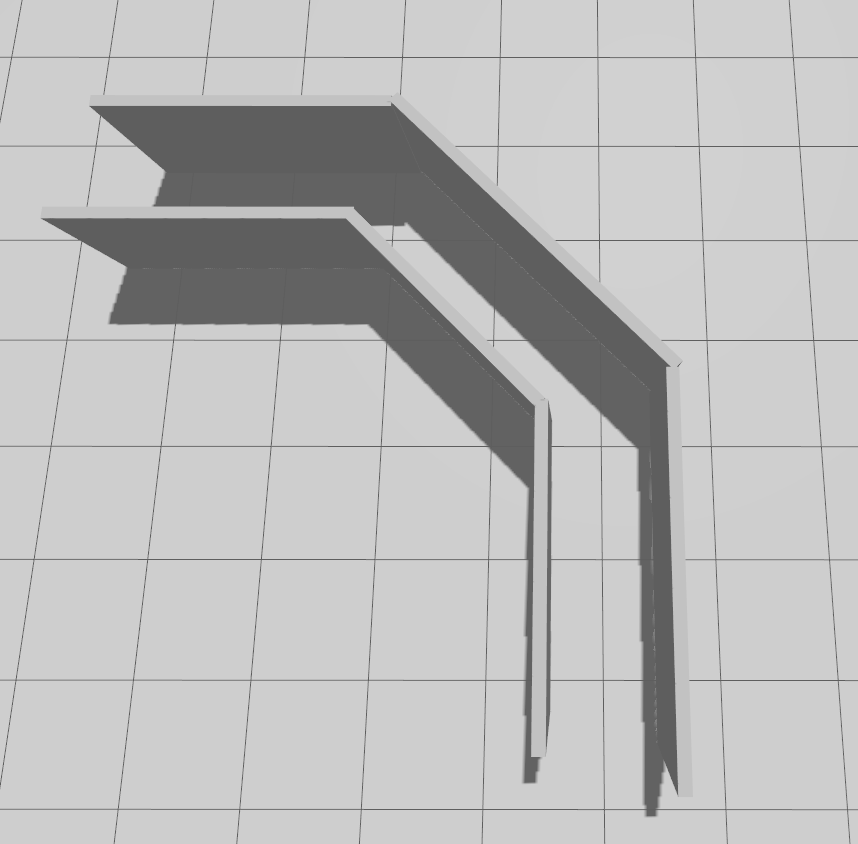
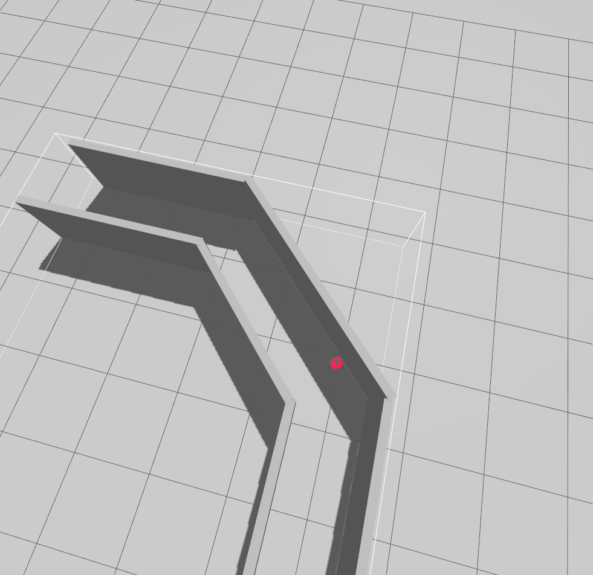
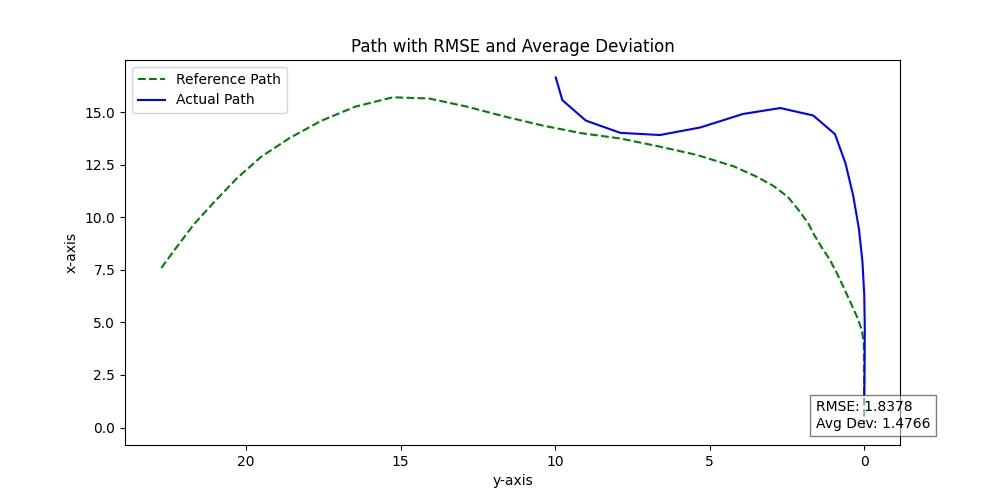
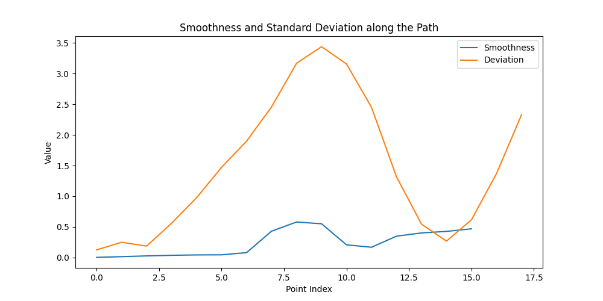
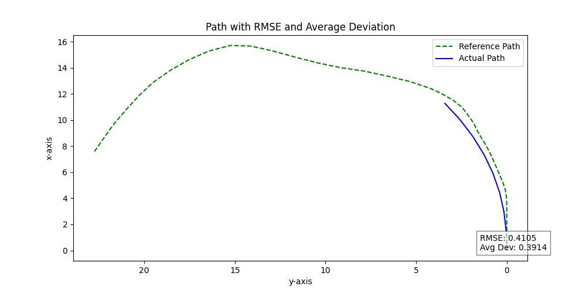
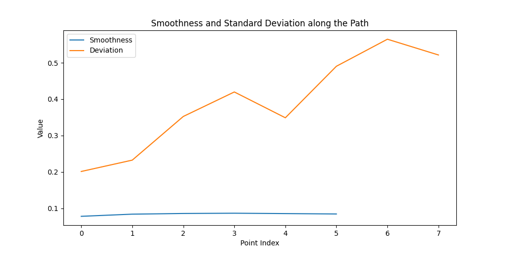
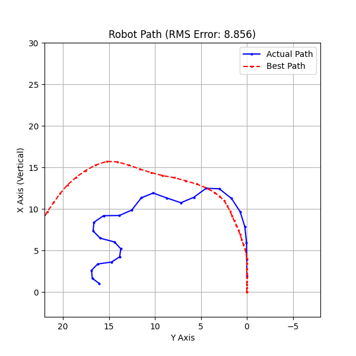
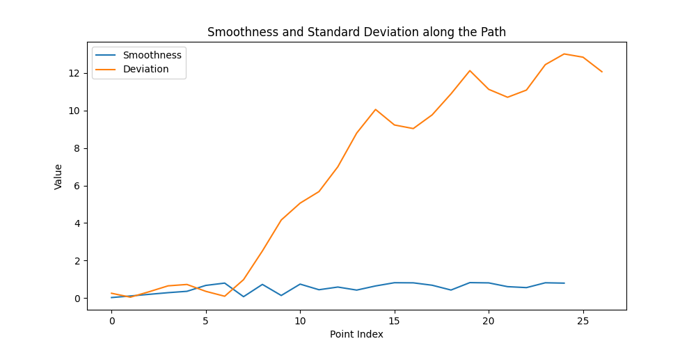
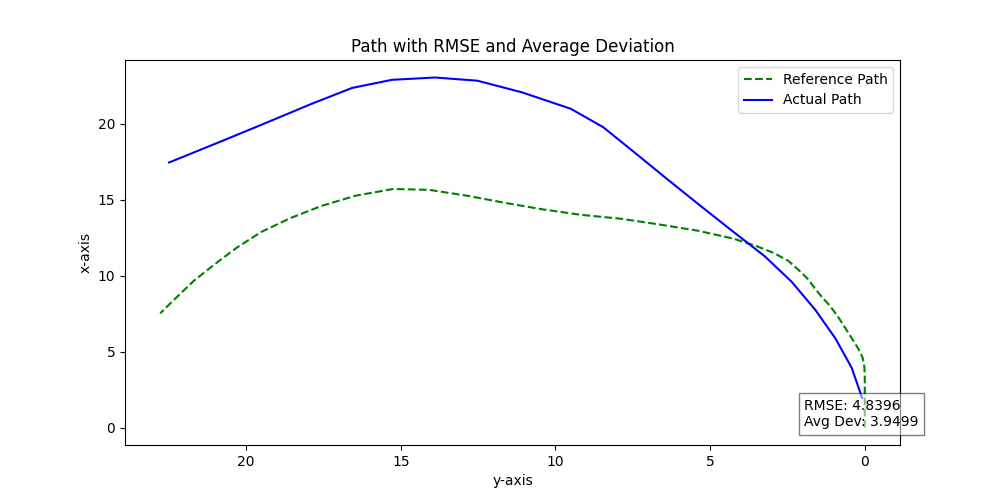
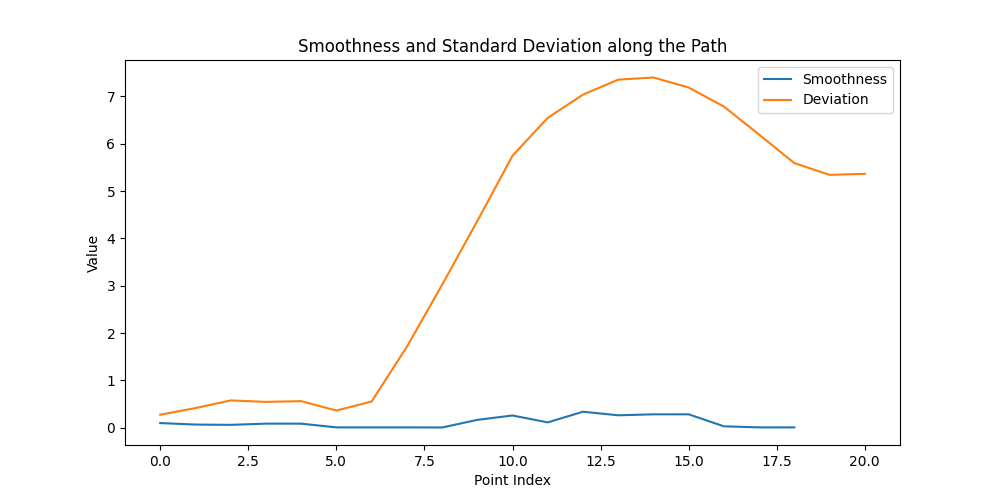

# AnalysingPlanningAlgorithms

## 1.  **Testing Reactive Algorithms for Mobile Robot Navigation**

This project focuses on testing different **reactive navigation algorithms** for a mobile robot **without velocity control mechanisms** like PID or Pure Pursuit. The goal is to evaluate how the robot reacts to **track with different conditions** using only **LiDAR data** for control.

## **Tested Algorithms**

The following algorithms were tested:

1. **Wall Follower**
2. **Naïve Gap Follower**
3. **Optimized Gap Follower**
4. **Center Line Following**

## **Experimental Setup**

#### **Robot and Simulation Environment**

- **Robot:** TurtleBot3
- **Sensors Used:** Only **LiDAR** (to control no additional sensors data were used in computaions)
- **Track Layout:**
  - **Structure:** The track consists of **three straight segments** connected by **two 45° left turns**.
  - **Dimensions:**

    - **Track width:** 1 meter
    - **Each straight segment:** 3 meters long
  - **Shape:** The path forms a structured test environment with **sharp turns and straight sections**, allowing for evaluation of how each algorithm handles both stability and directional changes.

<table align="center">
  <tr>
    <td align="center">
      
    </td>
    <td align="center">
      
    </td>
  </tr>
</table> 
#### Why Using This Path?

The chosen path is designed to evaluate **purely reactive algorithms** without any control mechanisms (e.g., PID, Pure Pursuit).

- **Tests Pure Reactive Behavior:** Robot navigates using **only LiDAR data**, without velocity or trajectory corrections.
- **Challenges Algorithms in Different Conditions:**
  - **Straight segments:** Assess stability.
  - **45° turns:** Test reaction to sudden directional changes.
- **Evaluates Path Following Accuracy Without Correction:** Metrics like **average deviation, RMSE, and smoothness** measure raw performance.
- **Observes Real-Time Adaptation:** Sharp turns reveal how each algorithm handles transitions without external control.
- **Ensures Fair Benchmarking:** A structured, repeatable environment allows **direct comparison of algorithms**.

### **Evaluation Metrics**

- **Plotted Paths:**
  - **Reference Path (Centerline of the Track)**
  - **Actual Robot Path**
- **Performance Metrics:**
  - **Average Deviation** (from the reference path)
  - **RMSE (Root Mean Square Error)** (from the refernce path)
  - **Path Smoothness**
  - **standard deviation**  (from the refernce path)

## **Results & Observations**

For each tested algorithm, the following key metrics are analyzed:

- **Plotted Path:** Comparison of the actual robot trajectory with the reference (centerline) path.
- **Average Deviation:** The mean lateral offset from the centerline path.
- **RMSE (Root Mean Square Error):** Measures the overall error between the actual and reference paths.
- **Smoothness:** Evaluates how stable and continuous the robot's movement is.

### **Results for Each Algorithm:**

For every algorithm, results will be structured as follows:

#### **1. Wall Follower**

- **Path Visualization:**

<table align="center">
  <tr>
    <td align="center">
      
    </td>
    <td align="center">
      
    </td>
  </tr>
</table>

The actual path deviates significantly from the reference path, especially after the second turn.
RMSE is 1.8378, and average deviation is 1.4766, indicating noticeable drift.
Smoothness decreases after turns, with sharp deviations due to reliance only on LiDAR data.
The algorithm struggles to stay centered, making it less stable for precise navigation.

#### **2. Naive Gap Follower**

- **Path Visualization:**

<table align="center">
  <tr>
    <td align="center">
      
    </td>
    <td align="center">
      
    </td>
  </tr>
</table>

The Naïve Gap Follower struggles with path tracking due to ignoring the robot's dynamics.
Deviation increases over time, and low smoothness indicates instability.
The high RMSE (0.4105) and average deviation (0.3914) confirm poor tracking, leading to a crash at the first turn.
A more advanced approach considering dynamics is needed for better performance.

#### **3. Center Following**

- **Path Visualization:**

<table align="center">
  <tr>
    <td align="center">
      
    </td>
    <td align="center">
      
    </td>
  </tr>
</table>

The Center Following approach performs better than the Naïve Gap Following method in maintaining stability and staying centered.
However, its RMSE (1.2453) and average deviation (0.9321) are higher because it completes the full path,
whereas the Naïve Gap Follower only accounts for the portion before crashing.
Despite minor deviations after turns, smoothness remains more consistent with fewer sharp corrections.
While the approach improves overall stability, some oscillations still occur when adjusting the trajectory.

#### **4. Bubbled Gap Follower**

- **Path Visualization:**

<table align="center">
  <tr>
    <td align="center">
      
    </td>
    <td align="center">
      
    </td>
  </tr>
</table>

The actual path follows the reference more closely compared to the centerline follower but still exhibits deviations.
RMSE is 4.8396, with an average deviation of 3.9499, indicating moderate drift.
Smoothness improves compared to centerline following but still shows variations, especially in complex turns.
The algorithm reacts better to obstacles but does not maintain perfect alignment with the reference path.
Deviation increases after turning points, suggesting that fine-tuning may be required for better trajectory adherence.

## **Installation & Usage**

### **Requirements**

Ensure you have the following installed:

- **ROS2**
- **gz sim (Ignition)**
- **Python3** (for plotting scripts if applicable)
- **required packages**: pandas , math , numpy , os , matplotlib

### **How to Run the Experiments**

for testing the traditional gap follower

```bash
ros2 launch robot_bringup bringup_robot.launch.py 
```

for testing the wall follower

```bash
ros2 launch robot_bringup bringup_robot_wallfollower.launch.py
```

for testing the center following

```bash
ros2 launch robot_bringup bringup_robot_centerFollowing.launch.py
```

for testing the (bubbled) gap follower

```bash
ros2 launch robot_bringup bringup_robot_optimized.launch.py
```

## **Future Work & Improvements**

- Optimize existing algorithms for better stability and accuracy.
- Investigate the integration of control algorithms to refine trajectory tracking, minimize deviations, and enhance smoothness in real-time.
- Explore planned algorithms with and without maps to compare performance:
  - Without a map: Develop purely reactive or heuristic-based navigation strategies that adapt dynamically to the environment.
  - With a map: Implement global planning techniques that optimize paths using prior knowledge while integrating reactive strategies for real-time adjustments.

## **Contributors & References**

- **Author:** : Zaynap Ahmed
- References and resources used in the project.
  - LaValle, S. M. (2006). Planning Algorithms. Cambridge University Press.
  - Stentz, A. (1995). The Focussed D Algorithm for Real-Time Replanning. Proceedings of the International Joint Conference on Artificial Intelligence (IJCAI).

---
